<p align="center">
  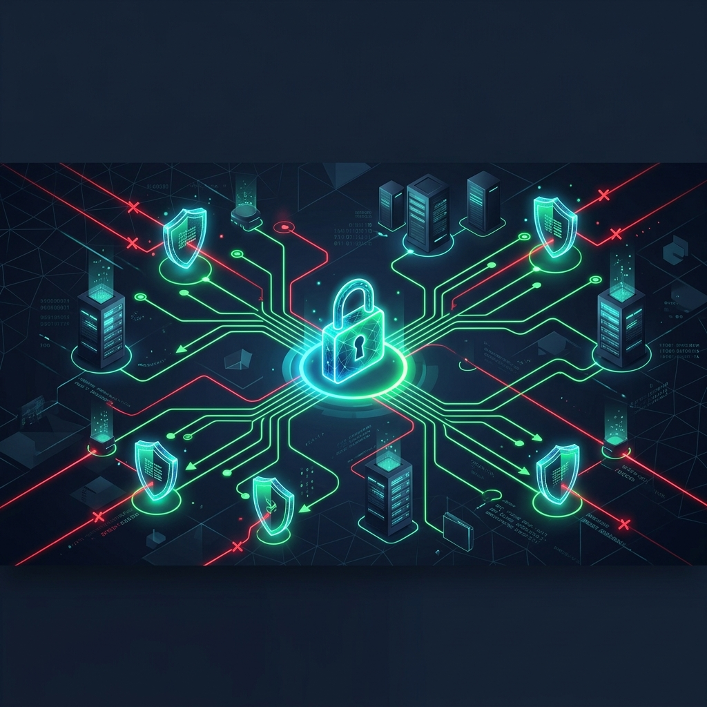
</p>

# 🛡️ Zero Trust Architecture (ZTA) 2026
### *Microsegmentazione, attestazione hardware, adaptive risk assessment e ispezione L7 per la protezione di database ospedalieri*

<p align="center">
  <a href="https://www.docker.com/"></a>
  <a href="https://www.envoyproxy.io/"></a>
  <a href="https://www.openpolicyagent.org/"></a>
  <a href="https://www.splunk.com/"></a>
  <a href="https://www.mongodb.com/"></a>
</p>
<p align="center">
  <a href="https://www.python.org/"></a>
  <a href="https://www.snort.org/"></a>
  <a href="https://netfilter.org/projects/nftables/"></a>
  <a href="https://www.latex-project.org/"></a>
</p>

---

Questo repository contiene il codice sorgente, le configurazioni di rete dockerizzate, i modelli predittivi e la relazione accademica relativi al progetto di **Advanced Cybersecurity** (Anno Accademico 2025/2026). 

L'obiettivo è la realizzazione pratica di un'infrastruttura di rete basata sul paradigma **Zero Trust (ZTA)** per la sicurezza e la microsegmentazione delle API e del database della collezione medica di un portale ospedaliero (San Raffaele). Il sistema applica il principio cardine **"Never Trust, Always Verify"** scartando qualsiasi richiesta di default e sottoponendola a validazione continua a livello di rete, credenziali, postura hardware, impronta digitale software e rischio comportamentale in tempo reale.

---

## 📖 Indice
1. [🔍 Panoramica del sistema](#-panoramica-del-sistema)
2. [⚙️ Flusso di verifica dinamico (animato)](#%EF%B8%8F-flusso-di-verifica-dinamico-animato)
3. [🌐 Architettura e microsegmentazione](#-architettura-e-microsegmentazione)
4. [⛓️ Flusso logico delle richieste (sequence)](#%EF%B8%8F-flusso-logico-delle-richieste-sequence)
5. [📊 La tupla multidimensionale ZTA (6D)](#-la-tupla-multidimensionale-zta-6d)
6. [🛠️ Simulazione e validazione dei cinque scenari](#%EF%B8%8F-simulazione-e-validazione-dei-cinque-scenari)
7. [🚀 Avvio dell'infrastruttura](#-avvio-dellinfrastruttura)
8. [👥 Autori e contesto accademico](#-autori-e-contesto-accademico)

---

## 🔍 Panoramica del sistema
Nelle reti tradizionali basate sul perimetro (*"castle-and-moat"*), l'intrusione all'interno della rete locale garantisce accesso illimitato alle risorse interne. Questo progetto neutralizza tale minaccia dividendo le risorse in aree segregate e ponendo all'ingresso un **Policy Enforcement Point (PEP)** rigido gestito da **Envoy Proxy**, coordinato con un **Policy Decision Point (PDP)** rappresentato da **Open Policy Agent (OPA)**.

Ogni singola transazione viene validata controllando:
- **identità forte**: certificati mTLS con crittografia asimmetrica.
- **integrità hardware**: verifica dell'attestazione hardware del chip **TPM** (Trusted Platform Module).
- **consistenza software**: fingerprinting **JA3** del browser per rilevare bot o manipolazioni di User-Agent.
- **rischio comportamentale**: calcolato in tempo reale con algoritmi di machine learning (Gradient Boosting) su **Splunk SIEM**.
- **analisi payload L7**: ispezione profonda dei verbi HTTP e delle query MongoDB per bloccare attacchi injection sul nascere.

---

## ⚙️ Flusso di verifica dinamico (animato)
L'immagine vettoriale interattiva sottostante illustra graficamente il percorso dei pacchetti dati all'interno del nostro sistema ZTA: i tentativi di accesso validati fluiscono in verde fino al Secure Core, mentre i tentativi malevoli o non conformi vengono catturati ed espulsi al gateway con un verdetto di **DENY** immediato.

<p align="center">
  
</p>

---

## 🌐 Architettura e microsegmentazione
La topologia di rete è strutturata in **quattro zone isolate** definite nel `docker-compose.yaml`. I client non possiedono alcuna via di instradamento diretto alle risorse protette, dovendo transitare obbligatoriamente per il canale cifrato controllato da Envoy.

<p align="center">
  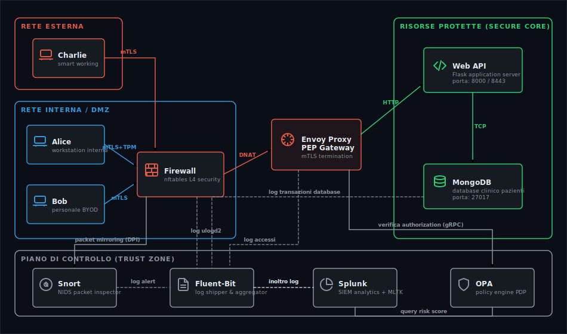
</p>


---

## ⛓️ Flusso logico delle richieste (sequence)
Il diagramma di sequenza mostra le fasi sequenziali attraverso le quali si dipana la validazione di una richiesta di accesso alle cartelle cliniche:

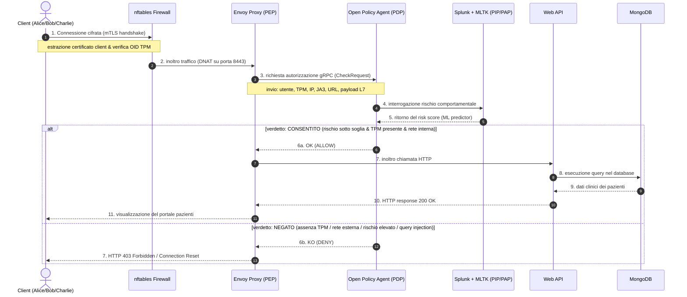

---

## 📊 La tupla multidimensionale ZTA (6D)
Per ogni richiesta, OPA valuta la tupla contestuale dinamica $T = (u, d, s, n, a, r)$:

1. **user ($u$)**: identità dell'utente autenticata via mTLS (`CN=employee-alice`).
2. **device ($d$)**: postura del client. OPA cerca l'OID proprietario `1.3.6.1.4.1.9999.1` iniettato nel certificato tramite attestazione TPM.
3. **software ($s$)**: hash del fingerprinting **JA3** calcolato da Envoy per garantire che il browser non sia emulato o compromesso.
4. **network ($n$)**: subnet di provenienza (Internal `192.168.1.0/24` vs External `10.0.1.0/24`).
5. **action ($a$)**: metodo di accesso applicativo (richieste `GET`/`POST` o query MongoDB `find`/`delete` ispezionate a livello L7).
6. **resource ($r$)**: endpoint o risorse target (es: `/api/patients`).

---

## 🛠️ Simulazione e validazione dei cinque scenari

Di seguito sono dettagliati i cinque scenari operativi simulati all'interno della rete di test:

| Scenario | Utente | Dispositivo | Rete | Azione / Payload | Esito OPA / Firewall | Logica di sicurezza |
| :--- | :--- | :--- | :--- | :--- | :--- | :--- |
| **1. Accesso legittimo** | Alice | Sicuro (TPM) | Interna | Ricerca pazienti | **ALLOW** | Risk score Splunk minimo ($\approx 9.96$), OPA autorizza l'accesso al DB. |
| **2. Dispositivo BYOD** | Bob | Personale (No TPM) | Interna | Autenticazione | **DENY** | Mancanza di attestazione TPM. Blocco immediato al login. |
| **3. Accesso da esterno** | Charlie | Sicuro (TPM) | Esterna | Autenticazione | **DENY** | Blocco preventivo dovuto alla localizzazione di rete non protetta. |
| **4. Bypass di rete L4** | Charlie | - | Esterna | Connessione diretta DB | **DROP (Firewall)** | `nftables` scarta i pacchetti diretti su porta `8000`. Snort allerta il SIEM. |
| **5. Injection L7** | Alice | Sicuro (TPM) | Interna | `DROP` / `DELETE` | **DENY (Envoy L7)** | Rilevamento payload malevolo a livello L7 tramite `mongo_proxy`. |

---

### 📂 Dettagli tecnici degli scenari ed evidenze grafiche

<details>
<summary><b>🟢 Scenario 1: accesso legittimo di Alice</b></summary>

* **descrizione**: l'utente Alice si connette dalla workstation ospedaliera interna dotata di chip TPM. 
* **flusso**: mTLS handshake OK $\rightarrow$ TPM check OK $\rightarrow$ Splunk risk score OK ($\approx 9.96 \le 50$) $\rightarrow$ Accesso consentito.
* **risultati**: Alice visualizza correttamente le informazioni cliniche dei pazienti.
* **evidenze**:
  
  *Schermata del portale di login ospedaliero:*
  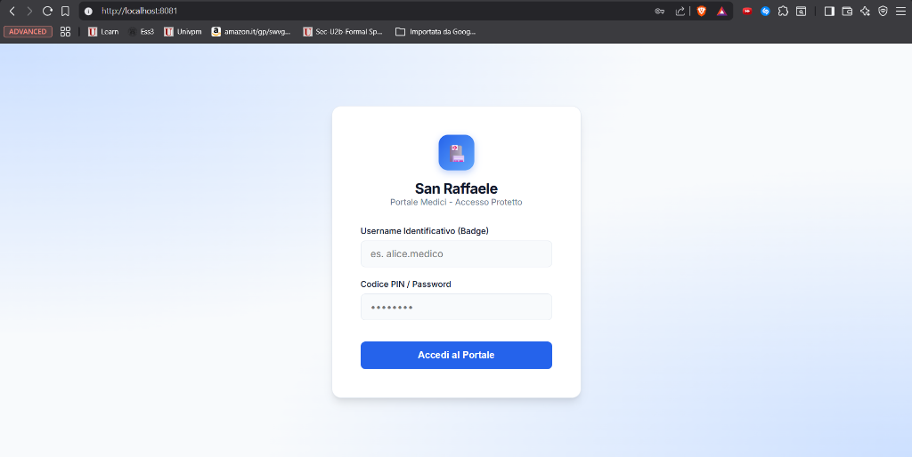
  
  *Portale pazienti sbloccato con successo:*
  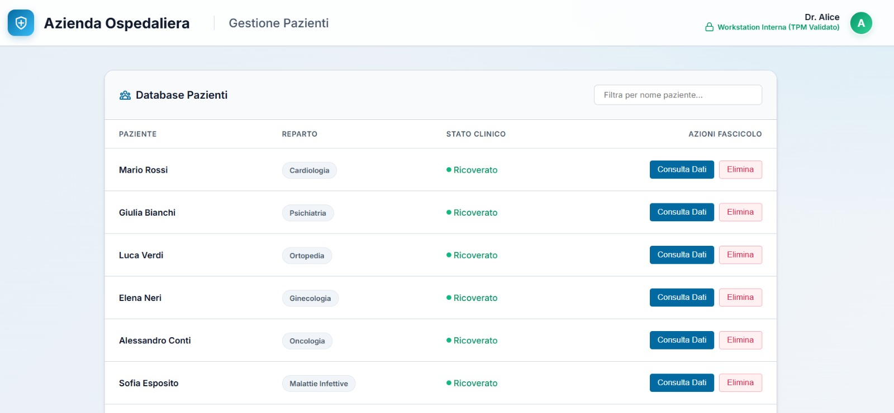
  
  *Log di autorizzazione OPA indicizzato in Splunk:*
  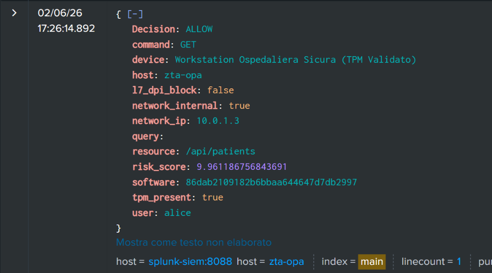

</details>

<details>
<summary><b>🔴 Scenario 2: dispositivo BYOD non autorizzato (Bob)</b></summary>

* **descrizione**: Bob tenta l'accesso usando credenziali valide ma dal proprio portatile personale (privo del chip TPM aziendale).
* **flusso**: mTLS handshake $\rightarrow$ OPA rileva `tpm_present: false` $\rightarrow$ Blocco al login.
* **risultati**: Bob riceve un errore HTTP 403 Forbidden e non può accedere a nessuna sessione.
* **logica chiave**: nonostante il rischio comportamentale stimato da Splunk sia bassissimo ($\approx 5.5$), l'assenza di TPM agisce come vincolo rigido non compensabile, determinando il verdetto di **DENY**.
* **evidenze**:
  
  *Schermata di blocco visualizzata da Bob:*
  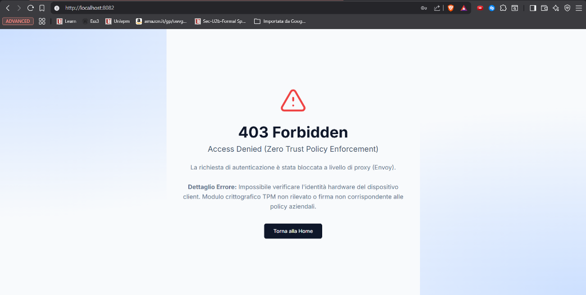
  
  *Log di blocco Splunk (evidenziata la mancanza di TPM):*
  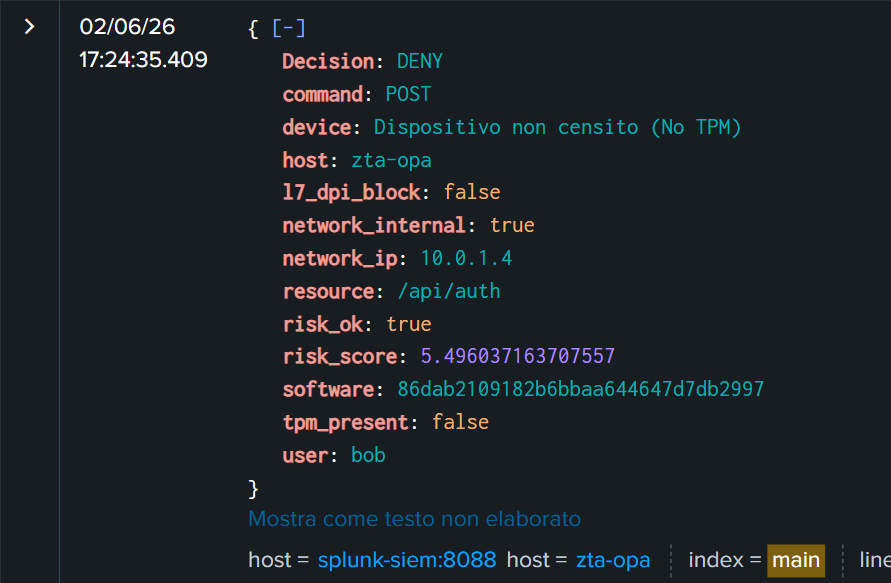

</details>

<details>
<summary><b>🟡 Scenario 3: accesso da rete esterna (Charlie)</b></summary>

* **descrizione**: Charlie tenta di collegarsi da casa (rete esterna/Smart Working) usando il suo laptop aziendale sicuro con TPM.
* **flusso**: mTLS handshake $\rightarrow$ OPA rileva `network_internal: false` $\rightarrow$ Blocco preventivo.
* **risultati**: Charlie viene bloccato al portale di login a causa delle politiche di restrizione geografica/IP.
* **evidenze**:
  
  *Schermata di blocco visualizzata da Charlie:*
  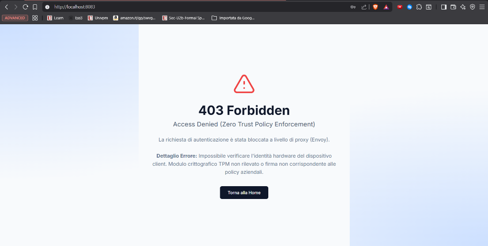
  
  *Log Splunk (blocco dovuto a network non interna):*
  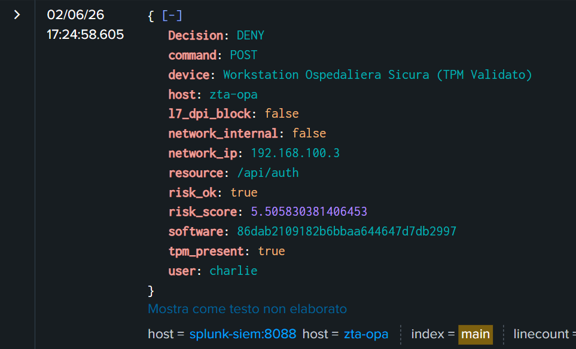

</details>

<details>
<summary><b>💥 Scenario 4: tentativo di bypass di rete a livello L4</b></summary>

* **descrizione**: un attaccante tenta di bypassare Envoy (PEP) provando a inviare query dirette alla porta interna delle API (`8000`) o del DB (`27017`).
* **flusso**: il client Charlie esegue un curl diretto $\rightarrow$ `nftables` intercetta il traffico anomalo $\rightarrow$ Regola `DROP` applicata $\rightarrow$ La sonda Snort NIDS rileva l'attività e allerta il SIEM $\rightarrow$ IP isolato permanentemente in denylist.
* **comandi di test**:
  ```bash
  docker exec -it zta-client-charlie curl -v --connect-timeout 3 http://zta-firewall:8000/api/patients
  ```
* **risultati**: connessione in timeout immediato. Il traffico anomalo viene scartato silenziosamente.
* **evidenze**:
  
  *Visualizzazione dei log di blocco nftables indicizzati in tempo reale in Splunk:*
  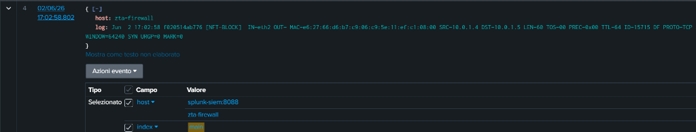

</details>

<details>
<summary><b>🛑 Scenario 5: ispezione e blocco di payload dannosi L7</b></summary>

* **descrizione**: Alice (compromessa o malintenzionata) tenta di inviare una query distruttiva (ad es. query di cancellazione MongoDB come `DROP` o `DELETE`) tramite la barra di ricerca.
* **flusso**: Envoy intercetta la richiesta L7 $\rightarrow$ Il filtro `mongo_proxy` inoltra il payload ad OPA $\rightarrow$ OPA individua le chiavi proibite nel corpo della richiesta $\rightarrow$ Verdetto **DENY L7** $\rightarrow$ MongoDB protetto.
* **risultati**: l'attacco injection fallisce immediatamente e ad Alice viene mostrato un errore HTTP 403 Forbidden.
* **evidenze**:
  
  *Schermata di errore injection intercettata a livello applicativo:*
  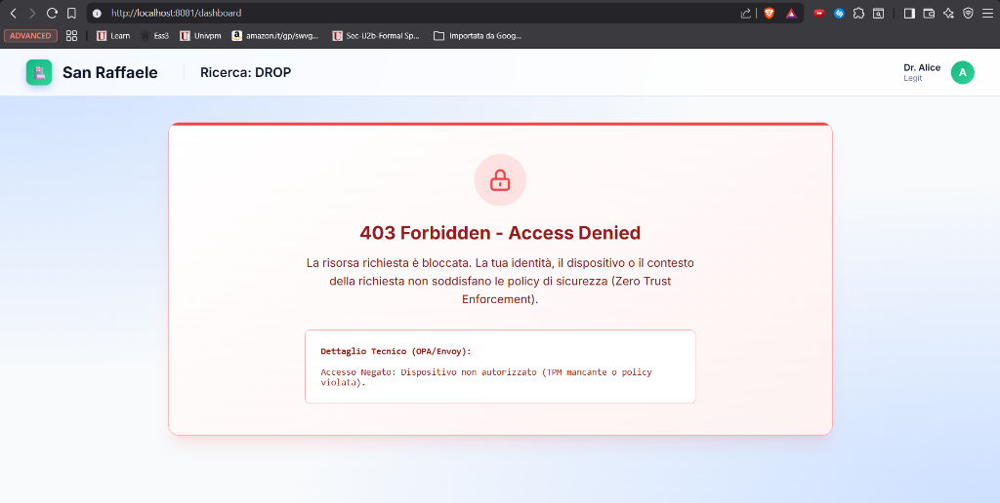
  
  *Log di blocco L7 in Splunk (intercettazione chiamata DELETE/DROP):*
  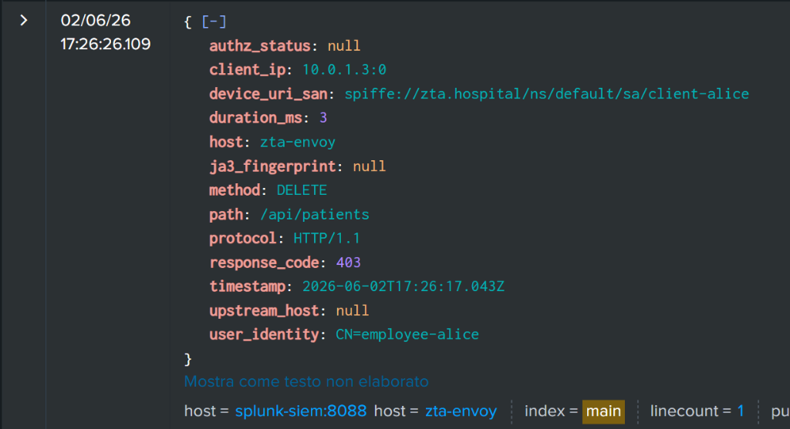

</details>

---

## 🚀 Avvio dell'infrastruttura

### Prerequisiti
- **Docker** e **Docker Compose** installati e funzionanti.
- Almeno 8GB di RAM dedicati a Docker (necessari per Splunk Enterprise e il modulo MLTK).

### Installazione e orchestrazione
1. Clona la repository locale:
   ```bash
   git clone https://github.com/ndreeeee/Advanced-Cybersecurity-for-IT-Project.git
   cd Advanced-Cybersecurity-for-IT-Project
   ```
2. Compila i moduli Docker e avvia l'intera infrastruttura di container:
   ```bash
   docker-compose up --build -d
   ```
3. Verifica che tutti i servizi siano in esecuzione e sani:
   ```bash
   docker ps
   ```

### Accessi di test
- **portale web (login)**: `http://localhost:8081` (per simulare i client Alice, Bob, Charlie).
- **console Splunk Enterprise**: `http://localhost:8000` (user: `admin`, password configurata in `.env`).
- **Open Policy Agent (regole API)**: `http://localhost:8181/v1/policies`

---

## 👥 Autori e contesto accademico

*Progetto finale di gruppo per il corso di **Advanced Cybersecurity** (Laurea Magistrale in Ingegneria Informatica e dell'Automazione).*
* **Ateneo**: Università Politecnica delle Marche (UNIVPM)
* **Docente**: Prof. Luca Spalazzi

<table align="center">
  <thead>
    <tr>
      <th align="center">Avatar</th>
      <th align="left">Candidato</th>
    </tr>
  </thead>
  <tbody>
    <tr>
      <td align="center"></td>
      <td align="left"><b>Andrea Flaiani</b> (Matr. 1126928)</td>
    </tr>
    <tr>
      <td align="center"></td>
      <td align="left"><b>Andrea Altieri</b> (Matr. 1128865)</td>
    </tr>
    <tr>
      <td align="center"></td>
      <td align="left"><b>Niccolò de Pascali</b> (Matr. 1123958)</td>
    </tr>
    <tr>
      <td align="center"></td>
      <td align="left"><b>Matteo Risolo</b> (Matr. 1122743)</td>
    </tr>
    <tr>
      <td align="center"></td>
      <td align="left"><b>Simone Murazzo</b> (Matr. 1113295)</td>
    </tr>
  </tbody>
</table>
