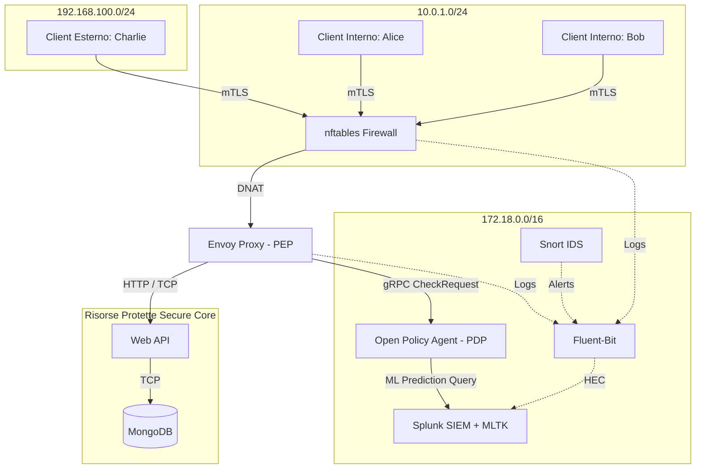
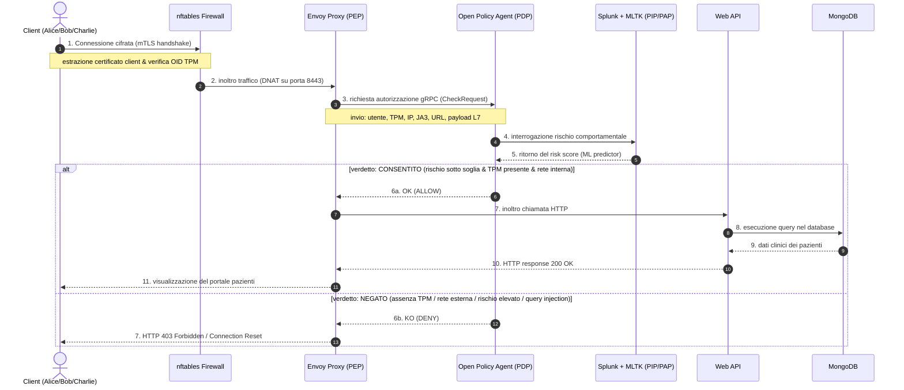

# 🛡️ Zero Trust Architecture (ZTA) 2026
### *Microsegmentazione, attestazione hardware, adaptive risk assessment e ispezione L7 per la protezione di database ospedalieri*

<p align="center">
  <a href="https://www.docker.com/"></a>
  <a href="https://www.envoyproxy.io/"></a>
  <a href="https://www.openpolicyagent.org/"></a>
  <a href="https://www.splunk.com/"></a>
  <a href="https://www.mongodb.com/"></a>
</p>
<p align="center">
  <a href="https://www.python.org/"></a>
  <a href="https://www.snort.org/"></a>
  <a href="https://netfilter.org/projects/nftables/"></a>
</p>

---

Questo repository contiene il codice sorgente, le configurazioni di rete dockerizzate, i modelli predittivi e la relazione accademica relativi al progetto di **Advanced Cybersecurity** (Anno Accademico 2025/2026).

L'obiettivo è la realizzazione pratica di un'infrastruttura di rete basata sul paradigma **Zero Trust (ZTA)** per la sicurezza e la microsegmentazione delle API e del database della collezione medica di un portale ospedaliero. Il sistema applica il principio cardine **"Never Trust, Always Verify"** scartando qualsiasi richiesta di default e sottoponendola a validazione continua a livello di rete, credenziali, postura hardware, impronta digitale software e rischio comportamentale in tempo reale.

---

## 📖 Indice
1. [🔍 Panoramica del sistema e Threat Modeling](#-panoramica-del-sistema-e-threat-modeling)
2. [🌐 Architettura e microsegmentazione](#-architettura-e-microsegmentazione)
3. [⛓️ Flusso logico delle richieste (sequence)](#%EF%B8%8F-flusso-logico-delle-richieste-sequence)
4. [📊 La tupla multidimensionale ZTA (7D)](#-la-tupla-multidimensionale-zta-7d)
5. [🛠️ I 14 Scenari di Validazione](#%EF%B8%8F-i-14-scenari-di-validazione)
6. [🚀 Avvio dell'infrastruttura](#-avvio-dellinfrastruttura)
7. [👥 Autori e contesto accademico](#-autori-e-contesto-accademico)

---

## 🔍 Panoramica del sistema e Threat Modeling
Nelle reti tradizionali basate sul perimetro (*"castle-and-moat"*), l'intrusione all'interno della rete locale garantisce accesso illimitato alle risorse. Questo progetto implementa un modello a verifica continua basato su concetti di Threat Modeling quantitativo e metodologico:

### Concetti Chiave di Threat Modeling
*   **Asset ($O$)**: Risorse di valore da proteggere, tra cui il database MongoDB (*Data at Rest*), il traffico delle Web API (*Data in Transit*) e i dati sanitari dei pazienti. Ad ogni asset è associato un valore di **Impatto ($I$)** in caso di compromissione della triade CID (Confidenzialità, Integrità, Disponibilità).
*   **Vulnerabilità ($V$)**: Debolezze intrinseche del sistema, come credenziali potenzialmente compromesse, dispositivi personali privi di modulo TPM, canali non cifrati o anomalie nei flussi operativi degli utenti.
*   **Minacce ($T$)**: Agenti o eventi in grado di sfruttare le vulnerabilità $V$ per colpire gli asset $O$ (esfiltrazione dati, lateral movement, injection, bypass dei proxy).

### Difesa in Profondità (Defense in Depth)
1.  **Meccanismi di Prevenzione (*ex ante*)**: Cifratura mTLS forte, regole deterministiche OPA (PDP) ed Envoy Proxy (PEP).
2.  **Meccanismi di Rilevamento (*ex post*)**: Analisi passiva e ispezione dei pacchetti con Snort NIDS, accoppiato con il monitoraggio e l'indicizzazione centralizzata su Splunk SIEM.

Il rischio complessivo viene modellato dinamicamente tramite la relazione:
$$R = L \times I$$
Dove **$L$ (Likelihood)** è calcolata continuamente in tempo reale basandosi sul **Trust Score** fornito da **Splunk MLTK** (tramite un modello predittivo *Gradient Boosting* su variabili comportamentali). Se il rischio $R$ supera la soglia di rischio accettabile $R_a$, scatta lo **Short-circuiting** logico ad opera del PEP (Envoy) o di `nftables`, bloccando immediatamente l'azione prima che possa raggiungere la risorsa.

---

## 🌐 Architettura e microsegmentazione
L'infrastruttura di rete è segmentata in **quattro zone isolate** definite all'interno del `docker-compose.yaml`. I client non possiedono vie di instradamento diretto alle risorse protette del Secure Core, dovendo transitare obbligatoriamente per il canale controllato e validato da Envoy.



---

## ⛓️ Flusso logico delle richieste (sequence)
Il diagramma di sequenza mostra le fasi sequenziali attraverso le quali si dipana la validazione di una richiesta di accesso alle cartelle cliniche:



---

## 📊 La tupla multidimensionale ZTA (7D)
Per ogni richiesta, OPA valuta la tupla contestuale dinamica $T = (u, d, s, n, a, r, b)$:

1. **user ($u$)**: identità dell'utente autenticata via mTLS (`CN=employee-alice`).
2. **device ($d$)**: postura del client. OPA cerca l'OID proprietario `1.3.6.1.4.1.9999.1` iniettato nel certificato tramite attestazione TPM.
3. **software ($s$)**: hash del fingerprinting **JA3** calcolato da Envoy per garantire che il browser non sia emulato o compromesso.
4. **network ($n$)**: subnet di provenienza (Internal `10.0.1.0/24` vs External `192.168.100.0/24`).
5. **action ($a$)**: metodo di accesso applicativo (richieste `GET`/`POST`/`DELETE` o query MongoDB `find`/`delete` ispezionate a livello L7).
6. **resource ($r$)**: endpoint o risorse target (es: `/api/patients`).
7. **behavior ($b$)**: Trust Score comportamentale dinamico. Il valore è derivato dall'arricchimento del payload tramite le seguenti feature calcolate in tempo reale dall'API:
    * `failed_logins`: conteggio dei login falliti nelle ultime 24 ore.
    * `session_freq`: frequenza di sessione rilevata nell'ultima ora.
    * `hour_of_day`: ora corrente della richiesta.
    * `is_night`: flag booleano per attività in orari non lavorativi.
    * `sensitivity_level`: livello di criticità della risorsa (scala 1-3).
    * `days_inactive`: indice di inattività storica dell'account.

---

## 🛠️ I 14 Scenari di Validazione
Di seguito sono descritti i 14 scenari operativi simulati all'interno della rete di test:

### Layer 1: Identità Crittografica & Trasporto (mTLS Envoy)
*   **Scenario 1: Connessione senza certificato client**
    *   *Descrizione*: Un client tenta di connettersi alle API senza fornire alcun certificato.
    *   *Esito*: **DENY (TLS alert)**. Envoy rileva la mancanza del certificato client e interrompe l'handshake in modo preventivo (`alert certificate required`), azzerando l'overhead per il resto del sistema.
*   **Scenario 2: Certificato non firmato dalla CA**
    *   *Descrizione*: Un attaccante tenta di autenticarsi con un certificato self-signed.
    *   *Esito*: **DENY (TLS alert)**. Envoy verifica la catena di fiducia e rigetta la connessione (`alert unknown ca`).

### Layer 2: Microsegmentazione L3/L4 (nftables)
*   **Scenario 3: Tentativo di bypass L4**
    *   *Descrizione*: Un client esterno prova a bypassare Envoy e collegarsi direttamente alle porte delle API (`8000`) o del DB (`27017`).
    *   *Esito*: **DROP (Firewall)**. Il firewall `nftables` applica una regola di drop silenzioso. Snort genera un allarme e Fluent-Bit invia i log `[NFT-BLOCK]` a Splunk per il monitoraggio.

### Layer 4-7: Policy Zero Trust (Envoy + OPA + Splunk MLTK)
*   **Scenario 4: Accesso legittimo da rete interna (Alice)**
    *   *Descrizione*: Alice accede dalla rete aziendale ospedaliera con PC dotato di TPM.
    *   *Esito*: **ALLOW**. mTLS valido, TPM presente, risk score Splunk minimo ($\approx 1$). Accesso consentito.
*   **Scenario 5: Blocco login per mancanza TPM (Bob)**
    *   *Descrizione*: Bob tenta l'accesso con credenziali corrette ma da un computer personale senza TPM.
    *   *Esito*: **DENY (OPA)**. OPA rileva l'assenza del TPM (`tpm_present: false`) ed effettua short-circuit restituendo HTTP 403 Forbidden.
*   **Scenario 6: Accesso legittimo da rete esterna (Charlie)**
    *   *Descrizione*: Charlie si connette da remoto per smart working usando il laptop aziendale (con TPM).
    *   *Esito*: **ALLOW**. Il modello ML calcola un rischio basso ($17.7$), inferiore alla soglia consentita per gli utenti remoti ($26$).
*   **Scenario 7: Accesso dati sensibili da interna (Alice)**
    *   *Descrizione*: Alice richiede l'accesso a note cliniche riservate (`/api/patients/sensitive`).
    *   *Esito*: **ALLOW**. Essendo in un contesto a massima fiducia (interna, TPM, no anomalie), l'accesso è concesso.
*   **Scenario 8: Accesso dati sensibili da esterna (Charlie)**
    *   *Descrizione*: Charlie prova ad accedere allo stesso endpoint sensibile da remoto.
    *   *Esito*: **DENY (OPA L7)**. OPA nega l'autorizzazione a livello L7 per via delle restrizioni di smart working (`l7_dpi_block: true`).
*   **Scenario 9: Accesso TCP diretto al database (Alice vs Bob)**
    *   *Descrizione*: Connessione TCP al database nativo su porta Envoy `27017` tramite script `pymongo`.
    *   *Esito*: **ALLOW** per Alice (TPM presente), **DENY (Connection Closed)** per Bob (TPM assente).
*   **Scenario 10: Protezione da payload dannosi L7**
    *   *Descrizione*: Alice tenta una query distruttiva (metodo `DELETE`) su `/api/patients`.
    *   *Esito*: **DENY (OPA L7)**. Envoy blocca la richiesta a livello L7 e restituisce un errore HTTP 403.
*   **Scenario 11: Compromissione del dispositivo e blocco comportamentale**
    *   *Descrizione*: Un attaccante ruba il PC di Alice (TPM e certificati validi) e tenta di accedere direttamente al DB MongoDB. Il modulo PIP inietta le metriche anomale (60 giorni di inattività, orario notturno, alta frequenza sessione).
    *   *Esito*: **DENY (OPA)**. Il modello ML Splunk rileva le anomalie calcolando un rischio estremo ($95.49 > 38$). OPA scatta bloccando la connessione TCP.

### Layer NIDS: Monitoraggio Perimetrale (Snort)
*   **Scenario 12: Rilevamento scansione di rete attiva (Nmap)**
    *   *Descrizione*: Un utente effettua una scansione dei servizi tramite `nmap -sV` verso Envoy.
    *   *Esito*: **DETECTION**. Snort rileva la scansione SYN e invia un alert a Splunk (sid: 1000001).
*   **Scenario 13: Audit delle connessioni native MongoDB**
    *   *Descrizione*: Tentativo di connessione diretta al database nativo bypassando le API.
    *   *Esito*: **DETECTION**. Snort traccia l'accesso non standard alla porta `27017` (sid: 1000002).
*   **Scenario 14: Rilevamento attacchi volumetrici (DoS)**
    *   *Descrizione*: Simulazione di attacco DoS SYN Flood verso la porta mTLS di Envoy.
    *   *Esito*: **DETECTION**. Snort rileva l'attacco al superamento delle soglie temporali ed allerta il SIEM (sid: 1000003).
*   **Scenario 15: Rilevamento attacco di downgrade (traffico in chiaro)**
    *   *Descrizione*: Invio di richieste HTTP non cifrate sulla porta protetta.
    *   *Esito*: **DETECTION**. Snort allerta per traffico HTTP in chiaro su porta TLS (sid: 1000004).

---

## 🚀 Avvio dell'infrastruttura

### Prerequisiti
- **Docker** e **Docker Compose** installati e funzionanti.
- Almeno 8GB di RAM dedicati a Docker (necessari per Splunk Enterprise e il modulo MLTK).

### Installazione e orchestrazione
1. Clona la repository locale:
   ```bash
   git clone https://github.com/ndreeeee/Advanced-Cybersecurity-for-IT-Project.git
   cd Advanced-Cybersecurity-for-IT-Project
   ```
2. Compila i moduli Docker e avvia l'intera infrastruttura di container:
   ```bash
   docker-compose up --build -d
   ```
3. Verifica che tutti i servizi siano in esecuzione e sani:
   ```bash
   docker ps
   ```

### Accessi di test
- **portale web (login)**: `http://localhost:8081`, `http://localhost:8082` e `http://localhost:8083` (per simulare i client Alice, Bob, Charlie).
- **console Splunk Enterprise**: `http://localhost:8000` (user: `admin`, password configurata in `.env`).
- **Open Policy Agent (regole API)**: `http://localhost:8181/v1/policies`

---

## 👥 Autori e contesto accademico

*Progetto finale di gruppo per il corso di **Advanced Cybersecurity** (Laurea Magistrale in Ingegneria Informatica e dell'Automazione).*
* **Ateneo**: Università Politecnica delle Marche (UNIVPM)
* **Docente**: Prof. Luca Spalazzi

*   **Andrea Flaiani** (Matr. 1126928)
*   **Andrea Altieri** (Matr. 1128865)
*   **Niccolò de Pascali** (Matr. 1123958)
*   **Matteo Risolo** (Matr. 1122743)
*   **Simone Murazzo** (Matr. 1113295)
