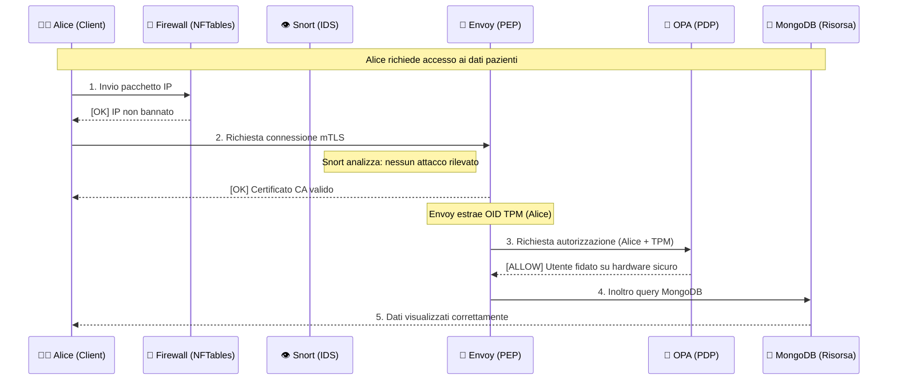

# 🛡️ Scenari di Flusso Zero Trust (ZTA 2026)

Questo documento illustra come la catena di difesa reagisce a un utente legittimo (Alice) e a un utente non autorizzato o malevolo (Bob/Hacker).

---

## ✅ Caso 1: Accesso Autorizzato (Alice)
**Profilo**: Alice utilizza un laptop aziendale con chip TPM verificato e un certificato mTLS valido.



### Perché Alice passa?
*   **Livello Rete**: Il suo IP è pulito.
*   **Livello Identità**: Possiede un certificato firmato dalla CA dell'ospedale.
*   **Livello Hardware**: Il certificato contiene il marchio TPM che garantisce l'uso di un PC aziendale.

---

## ❌ Caso 2: Accesso Negato / Bloccato (Bob o Attaccante)
**Scenario A**: Bob prova ad accedere da un PC personale (senza certificato o senza TPM).
**Scenario B**: Un hacker prova un attacco SQL Injection.

```mermaid
graph TD
    H[Hacker / Bob] -->|1. IP Bannato| FW[🧱 Firewall]
    FW -->|DROP| X((🛑 BLOCCO L3))
    
    B[Bob (No TPM)] -->|2. Connessione| PEP[🛂 Envoy PEP]
    PEP -->|mTLS Fail o No OID| PDP[🧠 OPA PDP]
    PDP -->|DENY| Y((🛑 BLOCCO L7))
    
    A[Attaccante] -->|3. Payload Malevolo| NIDS[👁️ Snort IDS]
    NIDS -->|Alert| S[📊 Splunk SIEM]
    S -->|Malus Trust| PDP
    PDP -->|Blocco Futuro| PEP
```

### Dove avvengono i blocchi?

1.  **Il Blocco mTLS (Envoy)**: Se Bob prova a connettersi senza il certificato giusto, Envoy chiude la sessione TCP. L'utente vede: `Connection reset by peer`.
2.  **Il Blocco Logico (OPA)**: Se Bob ha un certificato valido ma NON ha il chip TPM, OPA risponde `DENY`. Envoy restituisce un errore: `Unauthorized`.
3.  **Il Blocco Dinamico (SIEM)**: Se Snort rileva un attacco, Splunk abbassa il **Trust Score**. Anche se Alice fosse autorizzata, se il suo PC venisse compromesso, il Trust Score scenderebbe e OPA la bloccherebbe al volo.

---

## 📊 Riepilogo Livelli di Difesa

| Livello | Componente | Cosa controlla? | Esempio di Blocco |
|:---:|:---:|:---:|:---:|
| **1** | **NFTables** | Indirizzo IP / Porte | IP sospetto o blacklisted |
| **2** | **Snort** | Contenuto dei pacchetti | Tentativo di Exploit / SQLi |
| **3** | **Envoy (mTLS)** | Identità Digitale | Certificato mancante o scaduto |
| **4** | **Envoy (OID)** | Identità Hardware | **Mancanza del chip TPM** |
| **5** | **OPA** | Policy e Contesto | Accesso fuori orario o Trust Score basso |
