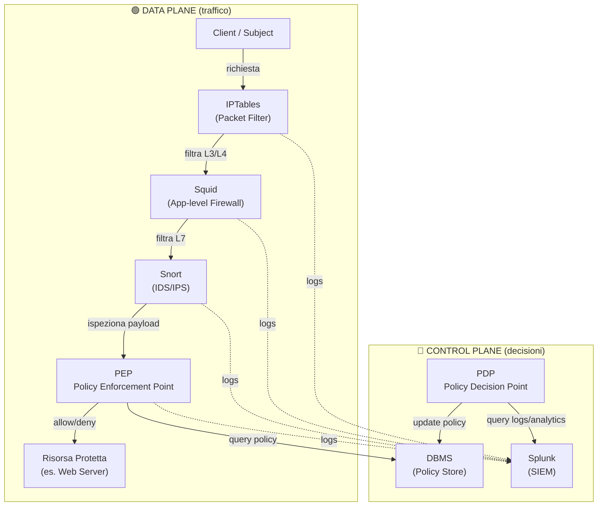
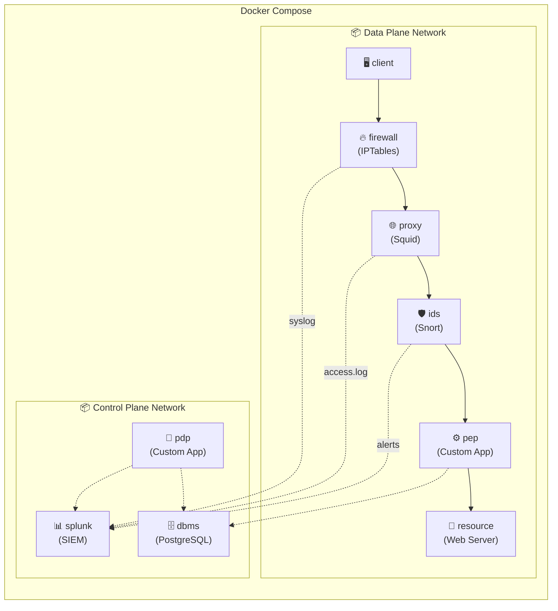
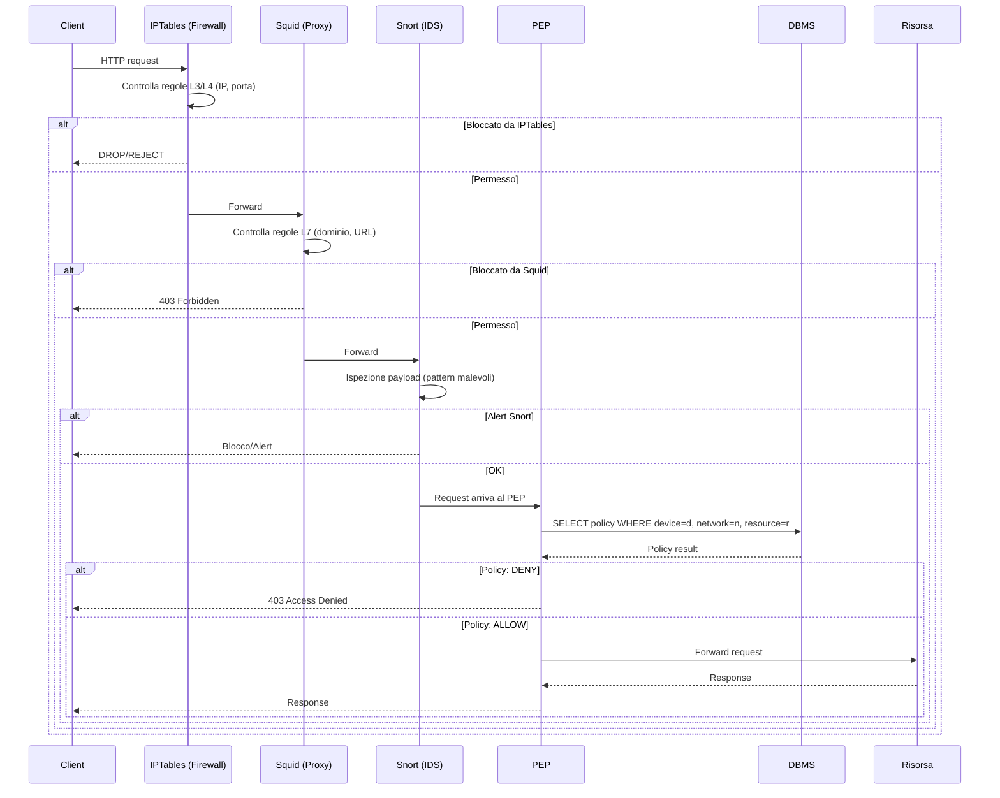
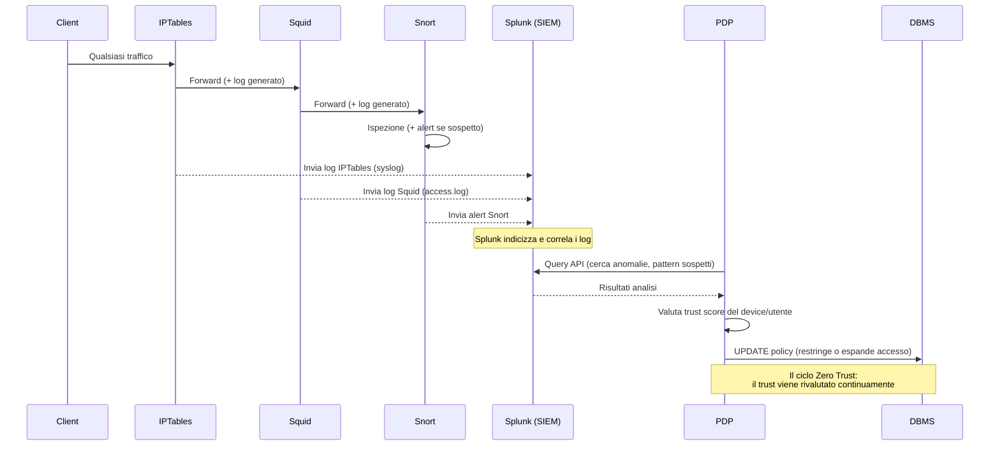

# 🏗️ Architettura Zero Trust — Progetto Advanced Cybersecurity 2025

## 📄 Cosa chiede il progetto

Dal PDF **Adv-2025-Projects** (Prof. Luca Spalazzi):

| Requisito | Dettaglio |
|---|---|
| **Tema** | Zero Trust Architecture (ZTA) |
| **Gruppo** | 4-5 persone |
| **Tool obbligatori** | Splunk, IPTables, Squid, Snort |
| **DBMS** | A scelta (PostgreSQL, MySQL, MariaDB...) |
| **Da sviluppare** | PDP (Policy Decision Point) e PEP (Policy Enforcement Point) |

> [!IMPORTANT]
> Il professore suggerisce di **assegnare ogni tool a una macchina dedicata**. La soluzione naturale è una **infrastruttura Docker multi-container**, dove ogni container simula una macchina indipendente.

---

## 🧠 Concetti chiave della Zero Trust Architecture

### I due piani



### Ruolo di ogni componente

| Componente | Ruolo | Tool |
|---|---|---|
| **PEP** | Enforcement: decide se lasciar passare o bloccare il traffico basandosi sulle policy nel DBMS | Codice custom (Python/Go) + configura IPTables e Squid |
| **PDP** | Decision: analizza i log storici via Splunk API e aggiorna le policy nel DBMS | Codice custom (Python/Go) |
| **IPTables** | Packet Filter (L3/L4): filtra per IP, porta, MAC, range di rete | `iptables` nativo nel container |
| **Squid** | Application Firewall (L7): filtra per hostname, dominio, URL, content-type | `squid` proxy |
| **Snort** | IDS/IPS: deep packet inspection, rileva pattern malevoli, genera alert | `snort` |
| **Splunk** | SIEM: raccoglie tutti i log, li indicizza, espone API per query/analytics | `splunk/splunk` (Docker image ufficiale) |
| **DBMS** | Policy Store: contiene le policy di accesso (chi può accedere a cosa, da dove, quando) | PostgreSQL / MariaDB |

---

## 🐳 Architettura Docker Multi-Container

### Mappa dei container

Ogni tool vive nel suo container, come richiesto dal professore:



### Container dettagliati

| # | Container | Immagine base | Ruolo | Rete |
|---|---|---|---|---|
| 1 | `client` | `ubuntu` o `alpine` + `curl`/`wget` | Simula l'utente/device che fa richieste | `data-plane` |
| 2 | `firewall` | `ubuntu` con `iptables` | Packet filter L3/L4, primo livello di filtraggio | `data-plane` + `control-plane` |
| 3 | `proxy` | `ubuntu/squid` o `sameersbn/squid` | Proxy applicativo L7, filtra per dominio/URL | `data-plane` + `control-plane` |
| 4 | `ids` | `linton/docker-snort` o custom | IDS/IPS, ispezione deep packet | `data-plane` + `control-plane` |
| 5 | `pep` | `python:3.11-slim` | PEP custom: orchestra le decisioni, query DBMS | `data-plane` + `control-plane` |
| 6 | `resource` | `nginx` o `httpd` | La risorsa protetta (web server, API) | `data-plane` |
| 7 | `splunk` | `splunk/splunk:latest` | SIEM, raccoglie log, espone REST API | `control-plane` |
| 8 | `dbms` | `postgres:16` o `mariadb:11` | Memorizza le policy | `control-plane` |
| 9 | `pdp` | `python:3.11-slim` | PDP custom: analizza log Splunk, aggiorna policy | `control-plane` |

---

## 🔄 I due Use Case dal PDF

### Use Case 1: Richiesta di accesso alla risorsa



### Use Case 2: Qualsiasi altra richiesta (raccolta log per il PDP)



---

## 🌐 Reti Docker

La separazione tra control plane e data plane si realizza con **due reti Docker distinte**:

```yaml
networks:
  data-plane:
    driver: bridge
    ipam:
      config:
        - subnet: 172.20.0.0/24    # Rete per il traffico dati
  control-plane:
    driver: bridge
    ipam:
      config:
        - subnet: 172.21.0.0/24    # Rete per gestione/policy
```

> [!TIP]
> I container che devono comunicare su **entrambi** i piani (es. PEP, firewall, proxy, IDS) vanno connessi ad **entrambe le reti**. Questo simula una macchina con due interfacce di rete.

---

## 📋 Tips dal PDF — Come si mappano nell'architettura

| Tip del Prof | Implicazione pratica |
|---|---|
| *IPTables identifica device per IP e MAC (stessa subnet)* | Il container `firewall` filtra per IP sorgente. MAC solo nella stessa rete Docker `data-plane` |
| *MAC cambia quando il traffico è routato tra reti diverse* | Non fare affidamento su MAC per identificare device cross-subnet |
| *Squid identifica per hostname* | Configurare ACL Squid basate su domini e subdomain |
| *IPTables/Squid identificano rete per range* | Usare subnet Docker per simulare reti diverse |
| *PEP è un DBMS Client* | Il container `pep` si connette a `dbms` via driver PostgreSQL/MySQL |
| *PDP è un SIEM Client* | Il container `pdp` si connette a `splunk` via REST API (porta 8089) |

---

## 🗂️ Schema del DBMS (Proposta)

```sql
-- Tabella delle policy
CREATE TABLE policies (
    id SERIAL PRIMARY KEY,
    device_id VARCHAR(50),         -- IP o hostname del device
    network_range CIDR,            -- Range di rete sorgente
    resource VARCHAR(255),         -- Risorsa target
    action VARCHAR(10) DEFAULT 'DENY',  -- ALLOW / DENY
    trust_score DECIMAL(3,2) DEFAULT 0.50,
    created_at TIMESTAMP DEFAULT NOW(),
    updated_at TIMESTAMP DEFAULT NOW()
);

-- Log delle decisioni PEP
CREATE TABLE access_log (
    id SERIAL PRIMARY KEY,
    device_id VARCHAR(50),
    resource VARCHAR(255),
    action_taken VARCHAR(10),
    policy_id INT REFERENCES policies(id),
    timestamp TIMESTAMP DEFAULT NOW()
);

-- Trust score storico
CREATE TABLE trust_history (
    id SERIAL PRIMARY KEY,
    device_id VARCHAR(50),
    old_score DECIMAL(3,2),
    new_score DECIMAL(3,2),
    reason TEXT,
    timestamp TIMESTAMP DEFAULT NOW()
);
```

---

## 🛠️ Piano di lavoro suggerito

Seguendo il **draft plan** del PDF:

| Fase | Attività | Container coinvolti |
|---|---|---|
| **1. Define policies** | Progettare lo schema DB, definire le regole IPTables, ACL Squid, regole Snort | `dbms`, `firewall`, `proxy`, `ids` |
| **2. Install tools** | Scrivere i Dockerfile, configurare docker-compose, testare che ogni container parta | Tutti |
| **3. Develop PDP e PEP** | Scrivere il codice custom per PEP (query DB + configura firewall) e PDP (query Splunk + aggiorna policy) | `pep`, `pdp` |
| **4. Test** | Simulare scenari di accesso dal `client`, verificare log su Splunk, validare aggiornamento policy | `client` → tutto il flusso |

---

## ⚠️ Punti aperti da chiarire

> [!WARNING]
> 1. **Quanti "livelli" di trust** vuole il prof? (es. trust score continuo 0-1, oppure livelli discreti come LOW/MEDIUM/HIGH?)
> 2. **Il PEP deve configurare dinamicamente** IPTables/Squid/Snort oppure basta che le regole siano statiche e il PEP faccia da gateway applicativo?
> 3. **Splunk Free vs Enterprise**: La versione Free ha limiti (500 MB/giorno di log). Per il progetto d'esame dovrebbe bastare la Free.
> 4. **Quale progetto specifico è stato assegnato al vostro gruppo?** Il PDF mostra un template generale — servono i dettagli specifici della vostra assegnazione per definire le policy concrete.
