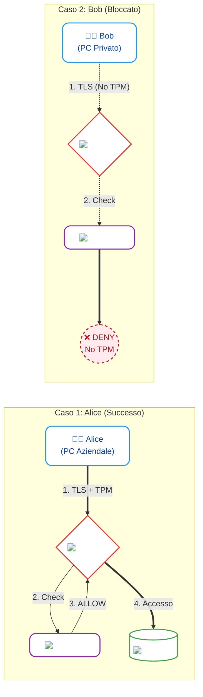
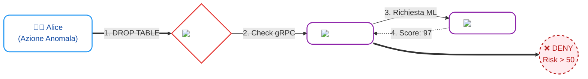
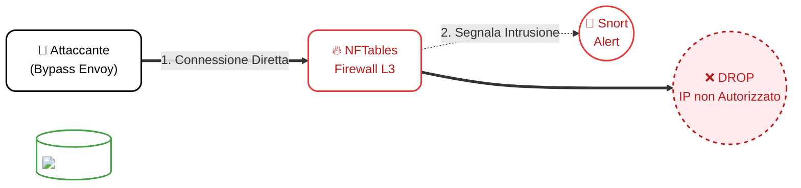
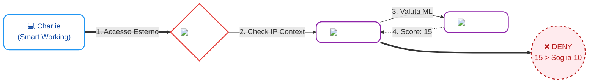

# Documentazione degli Scenari di Simulazione (ZTA 2026)

Questo documento spiega nel dettaglio come testare e dimostrare l'infrastruttura Zero Trust Architecture implementata per il progetto. Le interfacce web sviluppate permettono di visualizzare dinamicamente le reazioni dei componenti di sicurezza (Envoy PEP, OPA PDP, Splunk MLTK e Firewall) in risposta a diverse minacce.

---

## 🟢 Livello 1: Autenticazione e Verifica dell'Identità (Il caso Alice vs Bob)

Il primo livello dimostra l'implementazione del concetto *Device & Identity Verification*. In un sistema tradizionale, chiunque possieda le credenziali (username e password) può accedere al sistema. Nel nostro approccio ZTA, le credenziali sono solo il punto di partenza.

### Come testarlo:
1. **Accesso Legittimo (Alice)**: Collegandosi a `http://localhost:8081` si utilizza il client di Alice. Envoy estrae i campi del certificato mTLS e OPA valuta la presenza dell'OID `1.3.6.1.4.1.9999.1` (simulazione del chip TPM hardware). Dato che Alice usa un PC aziendale sicuro, l'accesso è **concesso**.
2. **Accesso Negato (Bob)**: Collegandosi a `http://localhost:8082` si utilizza il client di Bob. Il suo certificato è sprovvisto dell'estensione TPM. OPA intercetta la richiesta tramite Envoy e restituisce un **DENY** immediato (Errore `403 Forbidden`).

---

## 🔴 Livello 2: Rilevamento Anomalie e Insider Threat (Il Modello ML)

Il secondo livello dimostra la *Continuous Authentication*. Anche se un utente ha un dispositivo fidato, le sue azioni continuano ad essere monitorate per prevenire minacce interne (Insider Threat).

### Come testarlo:
1. Accedere alla dashboard tramite il client di Alice (`localhost:8081`).
2. **Simulazione Attacco SQLi**: Inserire nella barra di ricerca `DROP TABLE patients;` o `DELETE FROM records`.
3. **Cosa succede**: Splunk MLTK rileva l'anomalia comportamentale (una richiesta distruttiva da parte di un medico). Il **Trust Score** schizza oltre 50. OPA riceve questo score e blocca la richiesta sul nascere.

---

## 🏴‍☠️ Livello 3: Movimento Laterale e Bypass del Firewall (L3/L4)

L'ultimo livello dimostra la robustezza dei confini di micro-segmentazione. Un attaccante che ha compromesso un container potrebbe tentare di aggirare il proxy ZTA (Envoy) e colpire direttamente le API di backend.

### Come testarlo:
1. Accedere alla dashboard di Alice.
2. Premere `Ctrl + Shift + D` per aprire la **Console di Debug (Terminale Hacker)** nascosta.
3. Inserire il comando `curl http://backend-api:8000/api/patients`.
4. **Cosa succede**: Stai dicendo al container del client di scavalcare Envoy. Tuttavia, il Firewall L3/L4 (nftables) scarta (DROP) qualsiasi connessione al backend che non provenga esclusivamente dall'IP di Envoy.

---

## 🌐 Livello 4: Accesso Condizionato Adattivo (Adaptive Risk)

Il quarto livello espande il concetto di "Non fidarti mai" includendo il **contesto ambientale** dell'utente. La ZTA valuta dinamicamente la tolleranza al rischio.

### Come testarlo:
1. **Accesso Ospedale**: `http://localhost:8081` (Alice). OPA vede che l'IP è interno e tollera un `risk_score <= 50`.
2. **Accesso Esterno (Smart Working)**: Vai su `http://localhost:8083` (Charlie). OPA rileva l'IP esterno e **abbassa drasticamente la tolleranza al rischio (<= 10)**.
3. **Perché Charlie viene bloccato?** Charlie usa un dispositivo aziendale con un livello di rischio "normale" (es. 15). Se fosse in ospedale entrerebbe, ma dall'esterno la ZTA esige una salute del dispositivo impeccabile.

