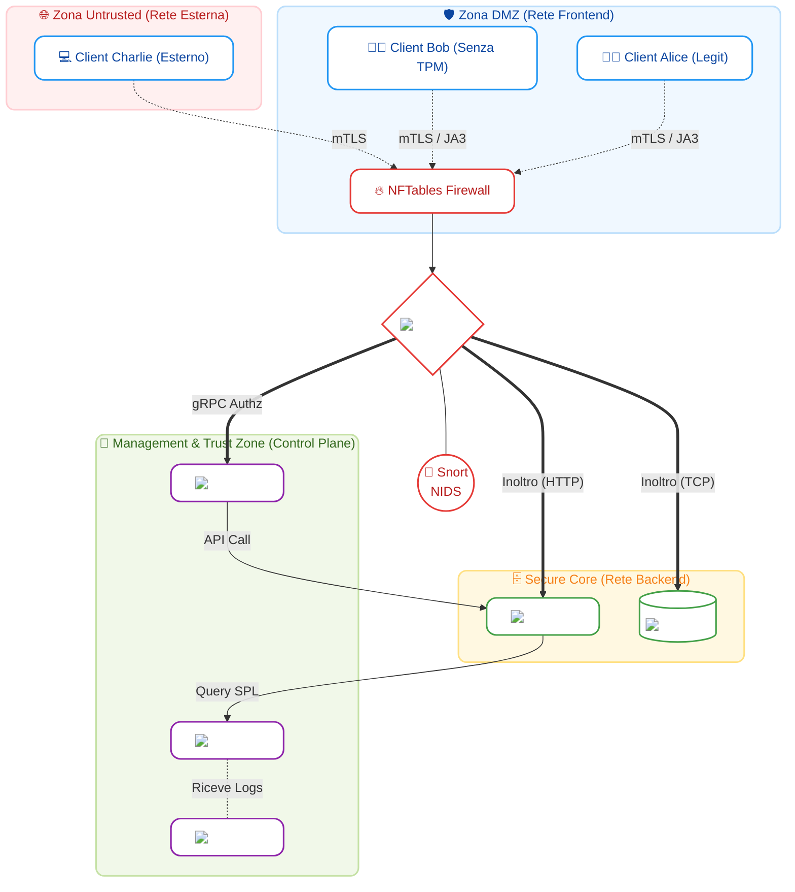
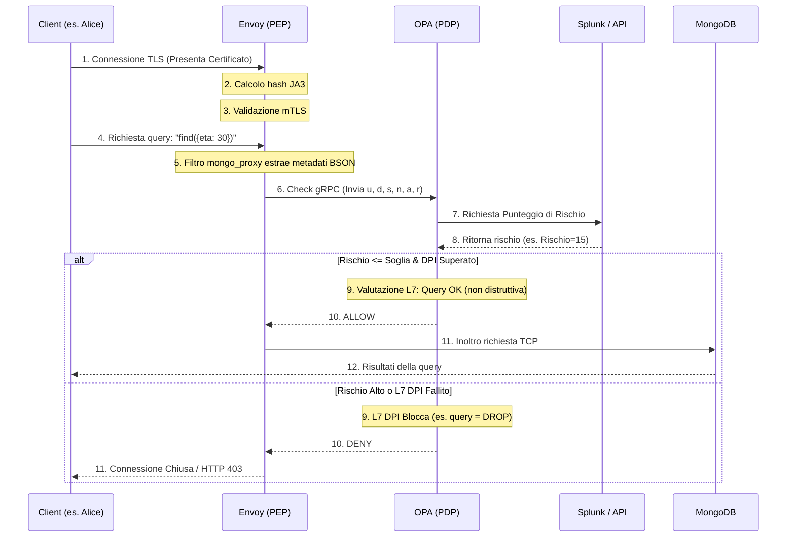

# Architettura dell'Applicazione Zero Trust (ZTA 2026)

Questo documento spiega nel dettaglio il funzionamento della nostra infrastruttura Zero Trust per il dominio ospedaliero. Il sistema è progettato per validare ogni singola richiesta (Never Trust, Always Verify) prima di concedere l'accesso a risorse sensibili (es. Database MongoDB o Web API).

---

## 1. Topologia di Rete e Componenti

L'infrastruttura è segregata in quattro reti Docker distinte, separate da regole firewall rigorose implementate con **NFTables** e monitorate passivamente da **Snort (NIDS)**.

## Spiegazione dell'Architettura a Zone

Per garantire il paradigma Zero Trust e la segregazione dei privilegi, l'infrastruttura è stata suddivisa rigorosamente in **4 scompartimenti logici isolati** (rappresentati dai riquadri colorati nel grafico):

### 1. 🌐 Zona Untrusted (Riquadro Rosso)
Rappresenta il "Far West", ovvero qualsiasi rete esterna (es. Wi-Fi pubblico o la connessione casalinga dello Smart Working). I client (come *Charlie*) che operano in questa zona sono considerati **altamente ostili** e non hanno alcuna rotta diretta verso il database. L'unico modo che hanno per comunicare con l'ospedale è superare il firewall raggiungendo il nodo centrale Envoy.

### 2. 🛡️ Zona DMZ / Frontend (Riquadro Azzurro)
È la "sala d'attesa" sicura, paragonabile alla rete locale fisica dell'ospedale. Ospita i client interni (medici e infermieri come *Alice* e *Bob*) e il **Firewall NFTables**, che agisce da primo buttafuori filtrando il rumore di fondo (L3/L4) prima ancora che il traffico raggiunga Envoy. I client in questa zona godono di un leggero vantaggio di trust rispetto alla Zona Untrusted, ma non sono comunque considerati intrinsecamente sicuri.

### 3. 🧠 Management & Trust Zone (Riquadro Verde)
Questa è la stanza dei bottoni (Control Plane). Si trova in una rete isolata inaccessibile ai client e comunica **solo** con Envoy e con le macchine del Backend. Qui risiedono:
*   **OPA (Policy Decision Point):** Il cervello che decide chi entra e chi no.
*   **Splunk (SIEM):** L'analista invisibile che sfrutta il Machine Learning (MLTK) per valutare in tempo reale il rischio basato sulle anomalie.
*   **Fluent Bit:** Il log shipper che raccoglie silenziosamente le tracce da ogni container per inviarle a Splunk.

### 4. 🗄️ Secure Core / Backend (Riquadro Giallo)
Il caveau vero e proprio. Nessun utente, né interno né esterno, possiede le rotte di rete per raggiungere direttamente quest'area. L'unico attore autorizzato a inoltrare pacchetti in questa zona è **Envoy (PEP)**, e lo fa *soltanto* dopo aver ricevuto il via libera dalla Trust Zone. Qui risiedono i dati clinici sensibili (**MongoDB**) e le **Web API** di consultazione.

---

### Il Cuore del Sistema: Envoy e Snort
Al centro di tutto il traffico si ergono **Envoy (PEP)** e **Snort (NIDS)**. 
Envoy è l'unica porta blindata tra la DMZ e il Secure Core: intercetta le chiamate, valida crittograficamente i certificati (mTLS), calcola l'impronta digitale del client (JA3) e si blocca in attesa del verdetto di OPA. Accanto a lui, Snort agisce come telecamera di sicurezza passiva, monitorando le anomalie di rete senza rallentare il flusso.

---

## 2. Le 6 Dimensioni Zero Trust (ZTA 6D)

Ogni singola richiesta, per essere autorizzata, viene profilata analizzando **6 dimensioni**:

1.  **User ($u$):** Identità dell'utente (estratta dal campo `CN` del certificato mTLS).
2.  **Device ($d$):** Stato dell'hardware. Si controlla se il certificato possiede l'Object Identifier (OID) speciale `1.3.6.1.4.1.9999.1` (che attesta l'uso di un chip TPM o Secure Enclave).
3.  **Software ($s$):** Impronta digitale del client. Estratta calcolando l'hash **JA3** durante la negoziazione TLS iniziale.
4.  **Network ($n$):** Indirizzo IP di provenienza. Distingue se la richiesta proviene dalla rete interna ospedaliera o dall'esterno.
5.  **Action ($a$):** L'operazione richiesta. Per HTTP è il metodo (es. `GET`, `DELETE`), per MongoDB è l'operazione (es. `find`, `drop`).
6.  **Resource ($r$):** La destinazione della richiesta (l'endpoint API o la Collection del database).

---

## 3. Flusso di Autorizzazione e Ispezione Profonda (DPI)

Il seguente schema mostra cosa succede, passo dopo passo, quando un client cerca di interrogare il database.

### La Deep Packet Inspection (DPI)
Oltre al calcolo del rischio, la nostra implementazione analizza il contenuto esatto delle richieste (L7 Firewalling):
*   **Nel Traffico Web:** Envoy utilizza un **filtro Lua** (`envoy.filters.http.lua`) che legge il path e il metodo HTTP. Se rileva chiamate non autorizzate (es. DELETE verso `/api/patients`), blocca immediatamente con un 403 Forbidden.
*   **Nel Traffico MongoDB:** Poiché MongoDB comunica in TCP nativo (dove Lua non può agire), Envoy decodifica i pacchetti BSON ed estrae la stringa della query esatta, passandola ad **OPA**. OPA analizza il testo della query (es. cercando parole vietate come `"dropdatabase"` o `"sensitive_notes"`) e innesca un blocco chirurgico.

---

## 4. Gestione Dinamica delle Soglie (Risk-Based Access)

Il PDP (OPA) adatta le sue decisioni dinamicamente. Non basta avere il certificato giusto; se il contesto cambia, l'accesso viene revocato:

*   **Rete Interna + TPM Presente:** Situazione sicura. L'accesso è consentito se il punteggio di rischio ML è $\le 50$.
*   **Rete Interna + TPM Assente (Solo Software JA3):** Situazione ambigua. Envoy si fida del software (tramite JA3) ma non dell'hardware. La soglia di tolleranza si abbassa: l'accesso è consentito solo se il rischio è $\le 30$.
*   **Rete Esterna (Smart Working):** Situazione pericolosa. L'accesso è consentito **solo** in presenza di TPM hardware e con un rischio bassissimo ($\le 10$). Se si prova da remoto senza TPM, la porta resta sbarrata.
