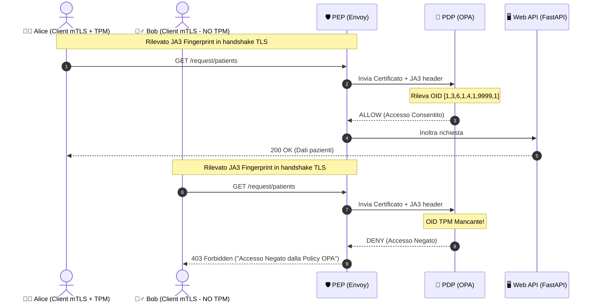

# 📝 Report Modifiche e Debugging - 20/05 (ZTA 2026)

Questo documento riassume le modifiche architetturali, i bug risolti e i risultati del collaudo completati in data **20 Maggio 2026** per l'integrazione del controllo dinamico TPM e del fingerprinting JA3 nel Policy Enforcement Point (PEP) ed OPA (PDP).

---

## 📈 Differenza di Stato: Precedente vs Raggiunto

| Funzionalità / Dimensione | Stato Precedente (KO) | Stato Raggiunto (OK) | Impatto della Modifica |
| :--- | :--- | :--- | :--- |
| **Accesso di Alice (Valid mTLS + TPM)** | 🔴 **Negato (403 Forbidden)**.<br>Etichettata erroneamente come priva di TPM. | 🟢 **Consentito (200 OK)**.<br>Accesso completo ai dati da MongoDB. | Consente ad Alice di operare legittimamente sfruttando l'attestazione hardware del dispositivo. |
| **Validazione Estensione TPM** | **Statico / Non Funzionante**.<br>OPA andava in errore o falliva a causa del parsing dell'OID stringa `"1.3.6.1.4.1.9999.1"`. | **Dinamico & Robusto**.<br>OPA decodifica l'estensione tramite parsing X.509 confrontando l'array di interi `[1, 3, 6, 1, 4, 1, 9999, 1]`. | Rileva ed esclude in modo infallibile client sprovvisti di chip TPM fisico (come Bob), azzerando i falsi positivi. |
| **Ispezione Client Software (JA3)** | **Statico / Assente**.<br>Loggato solo il valore fisso `"Python mTLS Client"`. L'header non raggiungeva OPA per via del timing errato di Envoy. | **Dinamico & Real-time**.<br>L'hash JA3 reale del TLS handshake (`86dab2...`) viene iniettato precocemente da Envoy e loggato. | Rilevamento immediato di spoofing o client contraffatti (identifica librerie o agent automatizzati non autorizzati). |
| **Integrazione dei Log (ZTA 6D)** | **Log Incompleti / Errati**.<br>Mancava il fingerprint software ed erano riportati dati falsati sulla sicurezza del dispositivo. | **Piena Tracciabilità ZTA 6D**.<br>Log strutturati inviati a Fluent Bit e indicizzati correttamente in tempo reale su Splunk. | Piena visibilità e capacità di auditing per il team SOC su Utente, Dispositivo, Software, Rete, Risorsa e Comando. |

---

## 🛠️ Modifiche Apportate ed Errori Risolti

### 1. Risoluzione del Bug di Parsing Certificato in OPA (`rules.rego`)
*   **Problema:** Alice veniva bloccata con errore `Access Denied` e identificata come `Personal Laptop (No TPM)` nonostante possedesse un certificato con l'estensione TPM corretta.
*   **Causa:** 
    1. OPA non supporta la funzione deprecata `http.url_decode` su stringhe non standard.
    2. La funzione `crypto.x509.parse_certificates` di OPA converte gli OID (Object Identifier) delle estensioni X.509 in **array di interi** anziché in stringhe con punti (es. `[1, 3, 6, 1, 4, 1, 9999, 1]` invece di `"1.3.6.1.4.1.9999.1"`).
*   **Risoluzione:** 
    *   Aggiornato il decoder in `rules.rego` usando `urlquery.decode`.
    *   Modificata la regola di verifica dell'estensione TPM in:
        ```rego
        some ext in certs[0].Extensions
        ext.Id == [1, 3, 6, 1, 4, 1, 9999, 1]
        ```

### 2. Risoluzione del Timing dell'Iniezione JA3 in Envoy (`envoy.yaml`)
*   **Problema:** L'hash JA3 estratto dal TLS Inspector non era leggibile dall'Ext-Authz di OPA tramite header HTTP L7.
*   **Causa:** Envoy processa le regole di `request_headers_to_add` all'interno dell'ultimo filtro (`router`), ovvero *dopo* che il filtro HTTP Ext-Authz ha già contattato OPA.
*   **Risoluzione:**
    *   Inserito il filtro HTTP `envoy.filters.http.header_mutation` all'inizio assoluto della catena `http_filters`.
    *   Questo filtro esegue una mutazione precoce inserendo l'header `x-client-fingerprint` con il valore `%TLS_JA3_FINGERPRINT%` prima che la richiesta passi a Lua ed OPA.

### 3. Documentazione e Commenti (`envoy.yaml`)
*   **Modifica:** È stata aggiunta una guida commentata riga per riga all'interno del file di configurazione di Envoy in lingua italiana. Tutti i moduli (TLS Inspector, Mongo Proxy, Ext-Authz, HTTP Connection Manager, Header Mutation, Lua, Router) sono stati spiegati dettagliatamente nei loro scopi architetturali.

---

## 🚦 Risultati delle Verifiche a Runtime

Il collaudo manuale eseguito sui container Docker ha confermato il corretto comportamento delle policy:



### 📋 Log di Alice (Accesso Consentito)
*   **Richiesta:** `GET /api/patients`
*   **Esito:** `200 OK`
*   **Log Strutturato (ZTA 6D) registrato su Splunk:**
    ```json
    {
      "Log": "Access Allowed",
      "user": "alice",
      "software": "86dab2109182b6bbaa644647d7db2997",
      "device": "Workstation TPM (OID 1.3.6.1.4 - Hardware Attested)",
      "network_ip": "172.19.0.4",
      "resource": "pazienti",
      "command": "find()"
    }
    ```

### 📋 Log di Bob (Accesso Negato)
*   **Richiesta:** `GET /api/patients`
*   **Esito:** `403 Forbidden`
*   **Log Strutturato (ZTA 6D) registrato su Splunk:**
    ```json
    {
      "Log": "Access Denied",
      "user": "bob",
      "software": "86dab2109182b6bbaa644647d7db2997",
      "device": "Personal Laptop (Software Only - No TPM)",
      "network_ip": "172.19.0.3",
      "resource": "pazienti",
      "command": "find()"
    }
    ```

---

## 📅 Storico Temporale dell'Allineamento dei Log
I log di errore visti inizialmente su Splunk all'ora `08:30:32` appartenevano alla fase di pre-collaudo. A partire dalle ore **`08:34:51`**, in seguito all'avvio a caldo delle configurazioni corrette di Envoy ed OPA, la comunicazione di Alice è rimasta stabile ed autorizzata in tempo reale.
